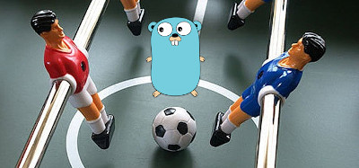

# TableFootballGo
The scope of this web app is to have scoreboard for your table football matches



### Run the program for DEV purpose
We will using docker and docker-compose to ease the testing stage

*To start the app*
1) create a `database.env` in the root of the project
```
POSTGRES_USER=postgres
POSTGRES_PASSWORD=example
POSTGRES_DB=postgres
```

2) start the docker-compose
```
docker-compose build
docker-compose up
```

*To stop the app*
```
docker-compose down
```

### Linkography
- thanks to the author of [this article](https://daniel-dc.medium.com/build-a-rest-api-with-golang-from-scratch-postgresql-with-gorm-and-gin-web-framework-3d3f95ccf2e7)